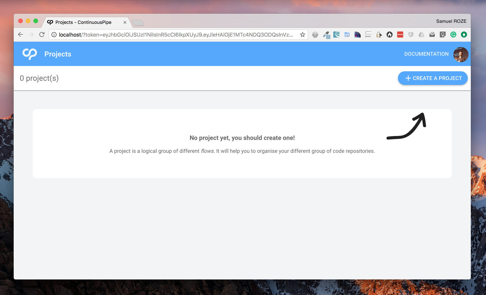
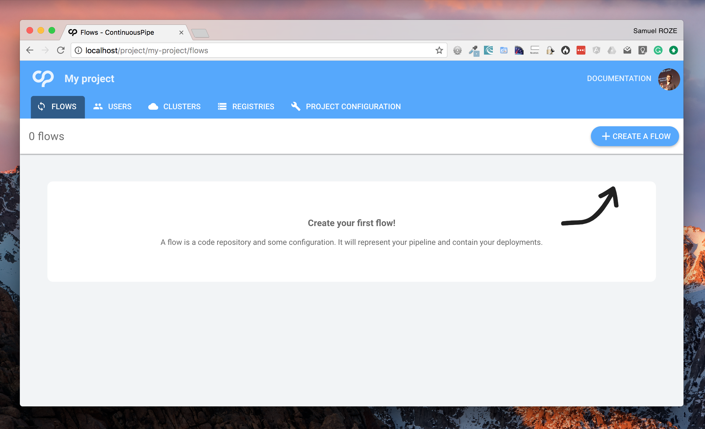
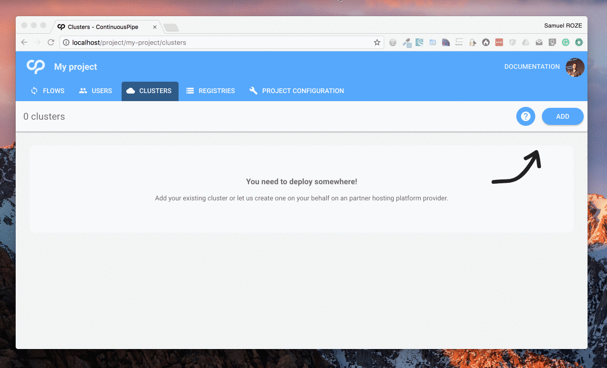
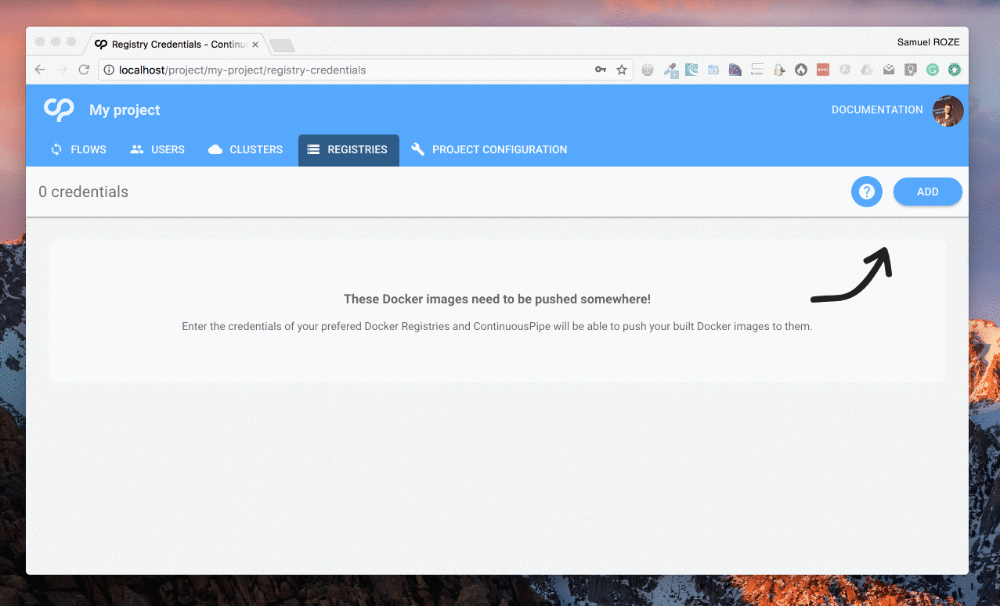
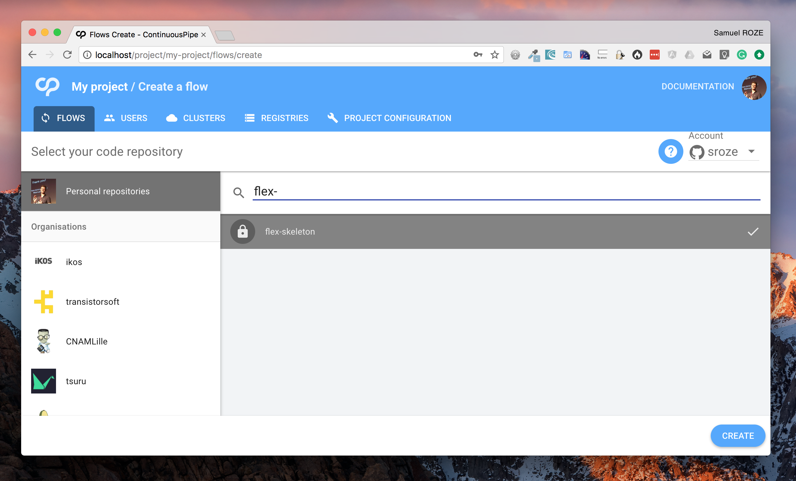
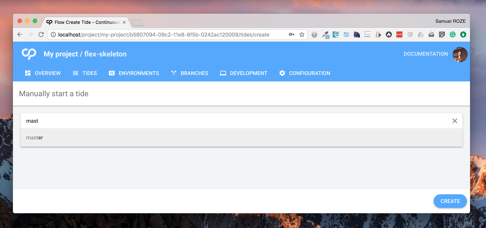
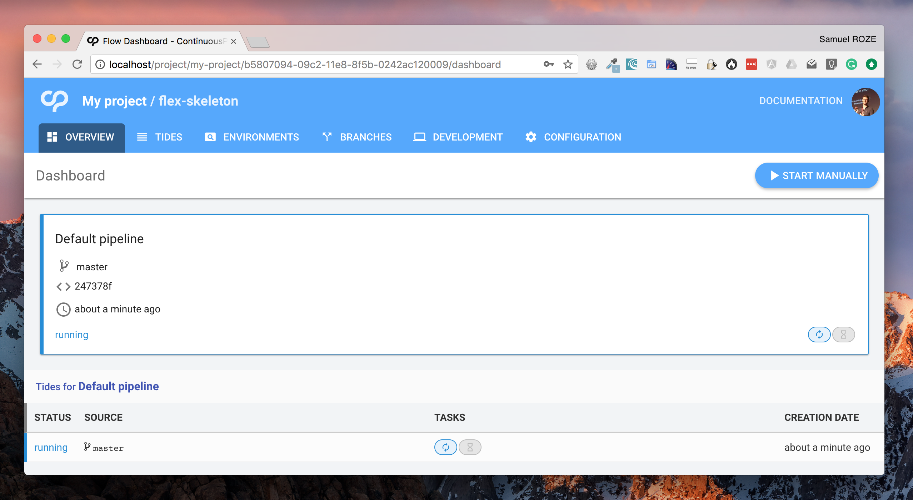
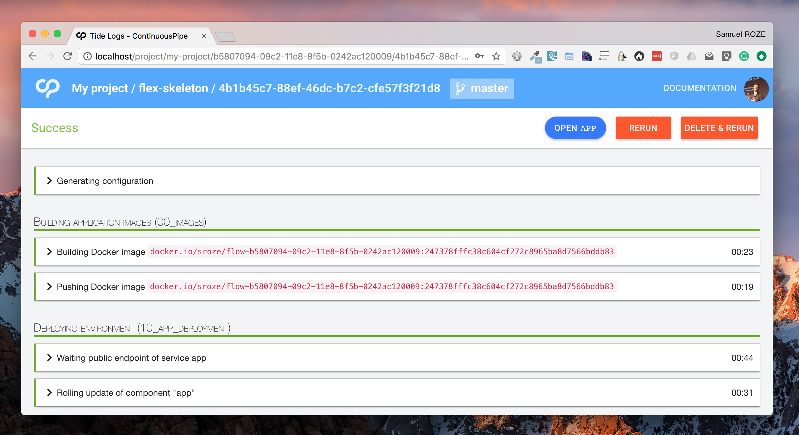

# First usage of ContinuousPipe

You have already [installed ContinuousPipe](INSTALL.md), probably explored [the documentation of ContinuousPipe](https://docs.continuouspipe.io) 
already and are looking at more details to ease your first usage of ContinuousPipe: you are at the right place!
You should see something like that:

This document will guide you through the following steps:

1. Create your first project, in which you will have your different _flows_.
2. Add your first Kubernetes cluster in your project
3. Add your Docker Registry credentials to your project
4. Create your flow, to connect your code repository
5. Start your first deployment!

## 1. Your first project

Click on the **Create a project** button. All you need is to give it a name. Once you've created your project, you should
see the following screen.

You can see that a project contains some flows (your code repositories), Docker Registries and Clusters. Lean more about the concept of "Project" [in the Concepts documentation](https://docs.continuouspipe.io/basics/concepts-continuous-pipe-concepts/#projects)

## 2. Add a Kubernetes cluster

You need to register a Kubernetes cluster, to be able to deploy applications to it. This can be the Kubernetes cluster on
which ContinuousPipe runs or can be something completely different.

Check out more details in the [Configuring a cluster](https://docs.continuouspipe.io/quick-start/configuring-a-cluster/) documentation.

## 3. Add some Docker Registry credentials

ContinuousPipe will build and push the Docker images for you. You need to add at least one Docker Registry credentials in
order to have ContinuousPipe building and pushing your Docker images!

Check out more details in the [Configuring a Docker Registry](https://docs.continuouspipe.io/quick-start/configuring-a-registry/) documentation.

## 4. Create your flow

Now, you are ready to create your first Flow. It's basically a code repository plus some configuration. Just click on 
the **Create a flow** button and select your code repository:

Once you have selected your flow, a checklist will appear. You can verify that your GitHub App has access to your code 
repository. Click on "Get started" to create your first deployment!

**Note:** You may also see options to automatically create and/or use an automated Kubernetes cluster and/or Docker Registry.
These are explained in the [Automation section](https://docs.continuouspipe.io/automation/) of the documentation.

## 5. Start your first deployment

After clicking on the "Get started" button, you should have seen a page suggesting you to push something to your code repository.
You can also click on the "Start manually" button to manually start a new tide:

Once your tide is created, you should be redirected back to the overview of the flow: 

Click on the tide in the list (bellow the _pipelines_) to see more details:

When your tide is finished, all you need is to click on the "Open app" button.

## More...

You want more? Check out [the documentation](https://docs.continuouspipe.io). You can also join [our Slack community](README.md#community),
even contribute to the code on GitHub.
